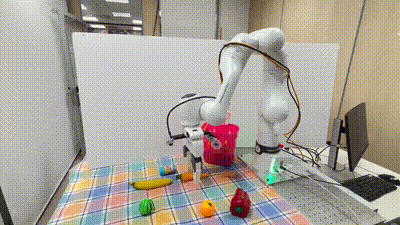
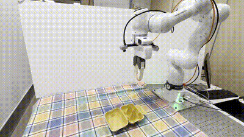
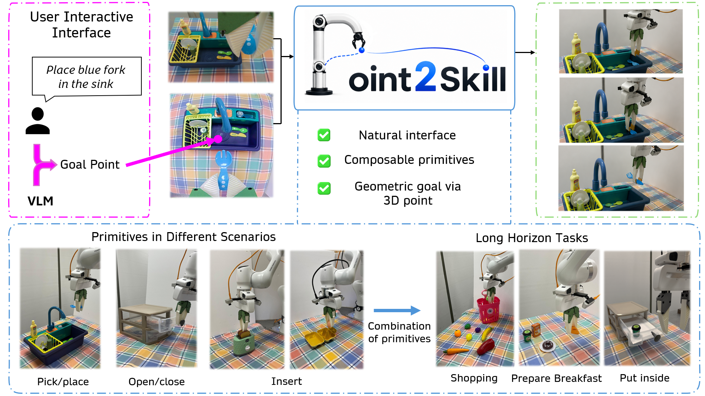

# Point2Skill: Interactive 3D Goal-Conditioned Diffusion Primitives for Robot Control

<p align="center">
  <a href="https://point2skill.github.io/Point2Skill-web/">
    
  </a>

  <!-- Add these badges when the corresponding links are public -->
  <!--
  <a href="PAPER_URL">
    
  </a>
  <a href="VIDEO_URL">
    
  </a>
  -->

  
  
</p>

<p align="center">
  <a href="https://point2skill.github.io/Point2Skill-web/"><b>🌐 Project Page</b></a>
  &nbsp;·&nbsp;
  <b>📄 Paper coming soon</b>
</p>

<p align="center">
  
  
  
  
</p>

**Point2Skill** is a framework for interactive robot manipulation that turns
**3D target points into steerable and reusable diffusion-based manipulation skills**.

Given a target point selected by a **human or a Vision-Language Model (VLM)**,
Point2Skill executes goal-conditioned manipulation primitives such as
**Pick, Place, Insert, Open, and Close**. These primitives can be reused across
objects and spatial configurations and composed to solve complex long-horizon tasks.

<p align="center">
  <b>Click a 3D point → Select a skill → Execute → Compose</b>
</p>

---

## Highlights

- 🎯 **3D goal-conditioned control:** specify exactly where the robot should interact.
- 🧩 **Reusable skill primitives:** Pick, Place, Insert, Open, and Close.
- 🔗 **Long-horizon composition:** combine primitives without task-specific retraining.
- 🖱️ **Human-interactive interface:** command the robot by clicking a target in the scene.
- 🤖 **VLM-driven execution:** a vision-language model can select both the primitive and its target.
- 🌍 **Generalization:** point-based conditioning enables transfer across object categories and spatial configurations.

## Results at a Glance

| Evaluation | Success Rate |
|---|---:|
| Goal-conditioning ablation | **90.0%** |
| Pick | **93.3%** |
| Place | **95.8%** |
| Open | **95.0%** |
| Close | **85.0%** |
| Insert | **90.0%** |
| Zero-shot unseen object generalization | **97.0%** |
| Held-out position generalization | **92.0%** |

## Method Overview

Point2Skill bridges high-level task intent and low-level robot control through
**3D goal-conditioned diffusion primitives**.

1. **Select a 3D goal.** A human or VLM identifies the desired interaction point.
2. **Condition the skill.** The 3D goal embedding modulates a Diffusion Transformer through adaptive Layer Normalization (adaLN).
3. **Execute a primitive.** The robot performs Pick, Place, Insert, Open, or Close.
4. **Compose behaviors.** Multiple primitives are sequenced to solve long-horizon manipulation tasks.

<p align="center">
  
</p>

## Primitive Skills

| Primitive | Description |
|---|---|
| **Pick** | Grasp a selected object from a 3D target point. |
| **Place** | Move and release an object at a goal-specified target region. |
| **Insert** | Align and insert an object into a target receptacle. |
| **Open** | Interact with and open a selected articulated object. |
| **Close** | Interact with and close a selected articulated object. |

## Long-Horizon Tasks

The same reusable primitives can be composed to execute complex manipulation tasks:

- 🛒 **Shopping:** repeatedly pick and place requested objects into a basket.
- ☕ **Put Coffee in Drawer:** Open → Pick → Place → Close.
- 🍳 **Prepare Breakfast:** compose Pick, Place, and Insert across multiple objects.

---

## Installation

```bash
git clone https://github.com/aatxag/Point2Skill_github.git
cd Point2Skill_github

conda create -n point2skill python=3.9
conda activate point2skill

## Training

python run_training.py

## Citation
@inproceedings{point2skill2026,
  title     = {Point2Skill: Interactive 3D Goal-Conditioned Diffusion Primitives for Robot Control},
  author    = {Anonymous Author(s)},
  booktitle = {Conference on Robot Learning},
  year      = {2026}
}

## License

This project is released under the MIT License.
# Add your installation command here
# pip install -r requirements.txt


