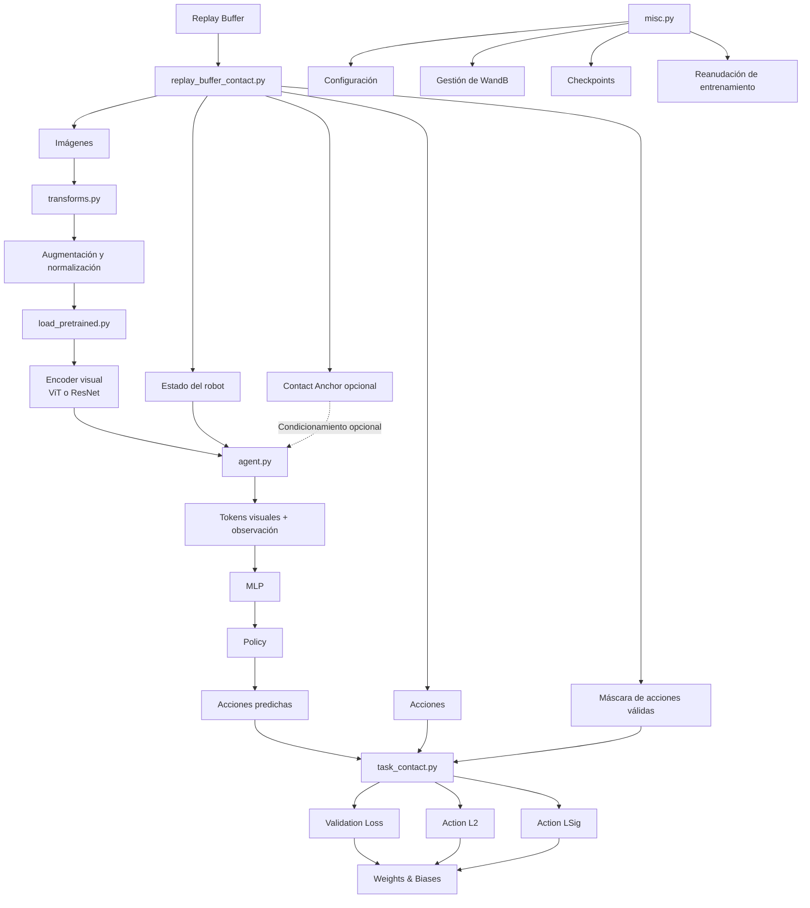

## SCRIPTS

### replay_buffer_contact.py

- Defines dataset of pytorch from robobuf data to train the policy.
     - buf.pkl
     - Carga trayectorias de robot
     - Separa train / test
     - Para cada transición extrae:
        - imágenes de cámaras
      - estado del robot
      - acciones futuras
      - máscara de acciones válidas
      - contact anchor opcional
- Logica completa:
1. Carga el replay buffer.

2. Carga ac_norm.json si existe.

3. Carga contact_norm.json si existe.

4. Hace shuffle reproducible.

5. Divide train/test.

6. Para cada transición:
      - obtiene una secuencia de acciones futuras;
      - crea una máscara;
      - hace padding si llega al final;
      - extrae el contact_anchor.

7. Cuando se solicita una muestra:
      - obtiene las imágenes;
      - añade frames anteriores;
      - opcionalmente añade goal image;
      - convierte todo a tensores;
      - devuelve observaciones, acciones, máscara
        y posiblemente contact_anchor.


### task_contact.py

- Evalúa una política de Behavior Cloning
     - Calcula la loss, el error cuadrático de las acciones y la proporción de predicciones con dirección/signo incorrecto, y registra todo en Weights & Biases

### transforms.py
- Preprocesar y aumentar las imagenes
- Se transforma la imagen, crop / resize ... , normalizacion para ImageNet, imagen prepararada para el encoder visual.
  
### misc.py
- Gestionar configuracion, WanDB, checkpoints y reanudacion
- Para crear, recuperar, entrenar.. checkpoints y guardar checkpoints

### load_pretrained.py
- Cargar el encoder visual preetrenado
     - ResNet-18 / ViT

### agent.py
- Define como convertir imagenes + estados en acciones
- Tiene dos clases principales
     - Base Agent
     - MLP Agent

# RESUMEN

## Pipeline general del sistema

El sistema procesa datos de demostraciones robóticas almacenadas en un **replay buffer**, aplica transformaciones visuales, extrae características mediante un encoder preentrenado y utiliza una política para predecir secuencias de acciones.

El pipeline completo es el siguiente:



### Descripción del flujo

1. **`replay_buffer_contact.py`**

   Carga las trayectorias almacenadas en el replay buffer y genera las muestras utilizadas durante entrenamiento y evaluación.

   Cada muestra puede contener:

   * imágenes de una o varias cámaras;
   * estado del robot;
   * secuencia de acciones futuras;
   * máscara para ignorar acciones de padding;
   * `contact_anchor` opcional.

   La salida tiene uno de los siguientes formatos:

   ```python
   ((images, observation), actions, loss_mask)
   ```

   o, cuando existe información de contacto:

   ```python
   ((images, observation), actions, loss_mask, contact_anchor)
   ```

2. **`transforms.py`**

   Aplica el preprocesamiento y las transformaciones visuales sobre las imágenes antes de introducirlas en el encoder.

   Dependiendo de la configuración, puede realizar:

   * resize;
   * random crop;
   * Gaussian blur;
   * color jitter;
   * conversión aleatoria a escala de grises;
   * normalización con estadísticas de ImageNet.

   Flujo simplificado:

   ```text
   Imagen original
          ↓
   Data augmentation
          ↓
   Resize / Crop
          ↓
   Normalización
          ↓
   Imagen preparada para el encoder
   ```

3. **`load_pretrained.py`**

   Carga el encoder visual preentrenado utilizado para extraer características de las imágenes.

   Actualmente soporta principalmente:

   * Vision Transformer, ViT;
   * ResNet-18.

   Flujo:

   ```text
   Imagen procesada
          ↓
   ViT o ResNet
          ↓
   Tokens / características visuales
   ```

4. **`agent.py`**

   Define la arquitectura base del agente encargado de convertir las observaciones en acciones.

   El flujo general es:

   ```text
   Imágenes
      +
   Estado del robot
      ↓
   Encoder visual
      ↓
   Tokens visuales
      ↓
   Incorporación de la observación
      ↓
   Flatten de los tokens
      ↓
   MLP
      ↓
   Política
      ↓
   Distribución de acciones
      ↓
   Acciones predichas
   ```

   De forma conceptual:

   [
   \hat{a}_{t:t+k} = \pi(I_t, s_t)
   ]

   donde:

   * (I_t) representa las imágenes de las cámaras;
   * (s_t) representa el estado del robot;
   * (\hat{a}_{t:t+k}) representa una secuencia de acciones futuras.

   Para utilizar información de contacto, la arquitectura debería extenderse a:

   [
   \hat{a}_{t:t+k} = \pi(I_t, s_t, c_t)
   ]

   donde (c_t) representa el `contact_anchor` o `contact_point`.

5. **`task_contact.py`**

   Gestiona la evaluación del modelo y permite trabajar con batches normales o batches que incluyan información adicional de contacto.

   Puede recibir:

   ```python
   ((imgs, obs), actions, mask)
   ```

   o:

   ```python
   ((imgs, obs), actions, mask, contact_point)
   ```

   Durante evaluación calcula tres métricas principales:

   * **Validation Loss:** pérdida total de validación.
   * **Action L2:** error cuadrático entre las acciones reales y las predichas.
   * **Action LSig:** proporción de componentes de acción cuyo signo predicho es incorrecto.

   El flujo de evaluación es:

   ```text
   Batch de evaluación
          ↓
   Detectar contact_point opcional
          ↓
   Mover tensores al dispositivo
          ↓
   Obtener acciones predichas
          ↓
   Comparar con acciones reales
          ↓
   Calcular Loss, L2 y LSig
          ↓
   Registrar métricas en WandB
   ```

6. **`misc.py`**

   Contiene utilidades generales relacionadas con la ejecución de experimentos.

   Sus principales responsabilidades son:

   * gestionar configuraciones con Hydra y OmegaConf;
   * inicializar experimentos en Weights & Biases;
   * guardar la configuración de cada ejecución;
   * reanudar experimentos anteriores;
   * gestionar checkpoints;
   * guardar automáticamente el estado del entrenamiento cuando se recibe una señal de interrupción.

---

## Resumen de la arquitectura

```text
Replay Buffer
     ↓
replay_buffer_contact.py
     ↓
┌───────────────────────────────┐
│ Imágenes                      │
│ Estado del robot              │
│ Acciones                      │
│ Máscara                       │
│ Contact Anchor opcional       │
└───────────────────────────────┘
     ↓
transforms.py
     ↓
Augmentación + normalización
     ↓
load_pretrained.py
     ↓
ViT / ResNet
     ↓
Características visuales
     ↓
agent.py
     ↓
Imágenes + Estado + Contacto opcional
     ↓
Tokens
     ↓
MLP
     ↓
Policy
     ↓
Acciones predichas
     ↓
task_contact.py
     ↓
Loss + Action L2 + Action LSig
     ↓
Weights & Biases

misc.py
     ├── Configuración
     ├── WandB
     ├── Checkpoints
     └── Reanudación del entrenamiento
```

## Flujo conceptual

En términos generales, el sistema aprende una política robótica a partir de demostraciones:

```text
Observación visual del entorno
              +
Estado actual del robot
              +
Punto de contacto opcional
              ↓
          Modelo
              ↓
Secuencia de acciones futuras
```

Matemáticamente:

[
\pi(a_{t:t+k} \mid I_t, s_t, c_t)
]

donde:

* (I_t): observaciones visuales;
* (s_t): estado proprioceptivo del robot;
* (c_t): punto o ancla de contacto opcional;
* (a_{t:t+k}): secuencia de acciones futuras predichas.

